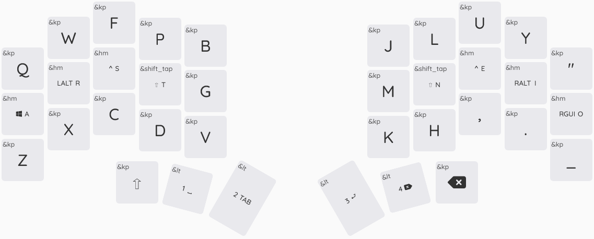

# chocofi-zmk-config

https://github.com/clab4950/chocofi-zmk-config

## Keymaps editor

https://nickcoutsos.github.io/keymap-editor/

## To transfer a UF2 firmware to a nice!nano v2, you can try these steps:
1. Get the UF2 file
   You can build a firmware and get the UF2 file by following the instructions on the Wireless Firmware page.
2. Prepare the nice!nano
   Press the RESET button on the board twice to prepare it to receive code. The board will appear as a USB drive on your computer.
3. Transfer the firmware
   You can copy and paste the UF2 file into the nice!nano using your terminal or file explorer.

## Layout
### Default layer [0]

### Number layer [1]

### Symbol layer [2]

### Mouse & Meh layer [3]

### Hotkey (Intellij) layer [4]

 